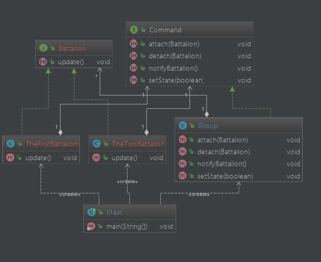

# 观察者模式        
观察者模式又叫发布-订阅(Publish/Subscribe)模式，经常应用在一个对象发生变化时，需要同时改变其他对象的时候。     


观察者模式主要成员就是主题(被观察者)Subject和观察者Observer,一个Subject可以有任意数量的Observer，一旦主题发生变化，其所有的Observer都能收到通知，从而做出相应的变化，同时，主题在通知状态变化时，并不需要知道谁是它的观察者，各个观察者之间也互相不清楚对方的情况。       


观察者模式的使用场景就是两个部分互相依赖，互相联系，但这必定要造成耦合，观察者模式做的事情就是解耦合，让耦合的双方全都依赖抽象，从而使一边发生的变化不会影响到另一边。             


## 假设场景          
有一个团去打仗，团下属几个作战营，各营的作战任务由团指挥部下达，而后各营进行自己的作战任务，在这里，团指挥部就是被观察者，各营就是观察者。        


### 简单实现        

* 先定义指挥部           

```Java
public class Group {
    //定义各个营的集合      
    private List<Battalion> observers = new ArrayList<>();
    //指挥部的命令状态，是否进攻
    private boolean attack;
    //注册观察者
    public void attach(Battalion observer){
        observers.add(observer);
    }
    //删除观察者
    public void detach(Battalion observer){
        observers.remove(observer);
    }
    //通知观察者改变状态
    //用循环将每个观察者都通知到      
    public void notifyBattalion(){
        for (Battalion battalion :
                observers) {
            battalion.update();
        }
    }
    //改变命令状态
    public void setState(boolean isAttack){
        if (isAttack == true){
            this.attack = true;
        }else {
            this.attack = false;
        }
    }
}
```       

* 定义营           

```Java
public class Battalion {

    private Group group;
    private String name;

    public Battalion(String name, Group command){
        this.name = name;
        this.group = command;
    }
    //当收到指挥部的命令后，营部做相应的变化
    public void update(){
        System.out.println(name + "收到命令，准备进攻");
    }
}
```     

* 实现         

```Java
public class Main {

    public static void main(String[] args) {
        //指挥部
        Group command = new Group();
        //一营
        Battalion one = new Battalion("一营",command);
        //二营
        Battalion two = new Battalion("二营",command);

        command.attach(one);
        command.attach(two);

        //指挥部下达攻击命令
        command.setState(true);
        command.notifyBattalion();
    }

}
```      

程序运行结果：      
```
一营收到命令，准备进攻
二营收到命令，准备进攻
```     

我们来分析一下，如果我们不只有一个营，要对多个营同时下达命令，而且可能在中间过程中对个别的营撤销命令，这时候就要去修改Group了，所以我们将主题和观察者都抽象出来，降低耦合          


### 观察者模式实现         

* 定义主题接口       


```Java
public interface command {
  public void attach(Battalion battalion);
  public void detach(Battalion battalion);
  public void notifyBattalion();
  public void setState(boolean isAttack);
}
```     

* 定义观察者接口       

```Java
public interface Battalion {
  public void update();
}
```     


* 实现团指挥部(具体主题)    
 和上面的指挥部很相似，只是将观察者队列定义为抽象类型        


```Java
public class Group implements Command{

    private List<Battalion> observers = new ArrayList<>();
    private boolean attack;

    @Override
    public void attach(Battalion battalion) {
        observers.add(battalion);
    }

    @Override
    public void detach(Battalion battalion) {
        observers.remove(battalion);
    }
    //用循环将每个观察者都通知到      
    @Override
    public void notifyBattalion() {
        for (Battalion battalion :
                observers) {
            battalion.update();
        }
    }
    @Override
    public void setState(boolean isAttack) {
        if (isAttack == true){
            attack = true;
        }else {
            attack = false;
        }
    }
}
```        

* 定义一营，二营(两个不同的观察者)       

```Java
public class TheFirstBattalion implements Battalion {
    private String name;
    private Command command;

    public TheFirstBattalion(String name, Command command) {
        this.name = name;
        this.command = command;
    }

    @Override
    public void update() {
        System.out.println(name + "接到通知，准备进攻");
    }
}

public class TheTwoBattalion implements Battalion {
    private String name;
    private Command command;

    public TheTwoBattalion(String name, Command command) {
        this.name = name;
        this.command = command;
    }

    @Override
    public void update() {
        System.out.println(name + "接到通知，准备进攻");
    }
}

```     


* 实现      

```Java
public class Main {

    public static void main(String[] args) {
        //具体指挥部
        Group group = new Group();
        //具体营(具体观察者)
        TheFirstBattalion one = new TheFirstBattalion("一营",group);
        TheTwoBattalion two = new TheTwoBattalion("二营",group);

        //指挥部决定发起攻击
        group.setState(true);

        //下达命令到一营和二营
        group.attach(one);
        group.attach(two);

        //战场形式发生变化，撤销二营进攻命令
        group.detach(two);

        group.notifyBattalion();
    }
}
```       

程序输出：       
```
一营接到通知，准备进攻

```      

* UML类图     



## 观察者模式的缺陷      
